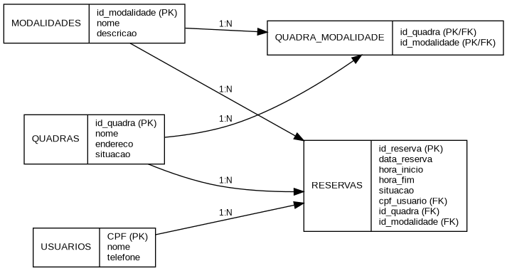
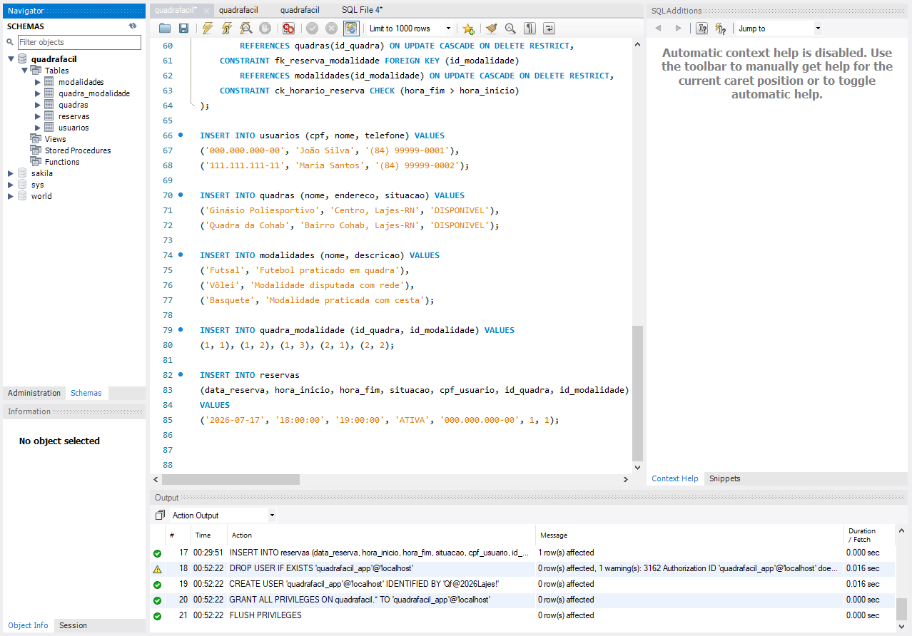
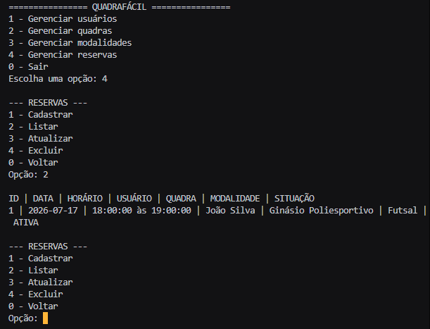

# QuadraFácil

Sistema em Java para gerenciamento de reservas de quadras esportivas.

O projeto utiliza uma modelagem feita anteriormente na disciplina de Banco de Dados, que foi adaptada para trabalhar com orientação a objetos, JDBC e interface em console.

## Problema

O controle manual das reservas pode causar conflitos de horários, perda de informações e dificuldade para consultar a utilização das quadras.

## Objetivo

Desenvolver um sistema que permita cadastrar, consultar, atualizar e excluir usuários, quadras, modalidades e reservas.

## Integrantes e contribuições

* **Luiz Fernando Lopes da Silva** — Organização do repositório, criação das issues e documentação no README, Desenvolvimento das operações de consulta, atualização e exclusão.
* **Willkiry Nathan Leandro da Silva** — Revisão da estrutura do projeto e dos requisitos da atividade.
* **José Layertoni da Silva Xavier** — Adaptação das classes Java e implementação das operações de cadastro.
* **José Igor de Lima Pegado** — Ajustes no banco de dados, tabelas e relacionamentos.
* **Luís Fernando da Trindade Aquino** — Revisão do DER, testes do sistema e correção de erros.


## Tecnologias utilizadas

- Java 21
- MySQL
- JDBC
- Visual Studio Code
- Git e GitHub

## Entidades principais

- Usuário
- Quadra
- Modalidade
- Reserva

A tabela `quadra_modalidade` representa quais modalidades podem ser realizadas em cada quadra.

## Funcionalidades

O sistema possui operações de cadastro, consulta, atualização e exclusão para:

- usuários;
- quadras;
- modalidades;
- reservas.

Também existe uma verificação para evitar reservas com conflito de horário na mesma quadra.

## Estrutura do projeto

- `src`: código-fonte Java;
- `database/quadrafacil.sql`: script de criação do banco;
- `docs/DER.png`: diagrama entidade-relacionamento;
- `docs`: capturas dos testes;
- `lib`: driver JDBC do MySQL.

## Como executar

### Banco de dados

Abra o MySQL Workbench e execute o arquivo:

```text
database/quadrafacil.sql
```

### Configuração da conexão

A aplicação utiliza as variáveis de ambiente:

```text
QUADRAFACIL_DB_USER
QUADRAFACIL_DB_PASSWORD
```

Exemplo no PowerShell:

```powershell
$env:QUADRAFACIL_DB_USER = "seu_usuario"
$env:QUADRAFACIL_DB_PASSWORD = "sua_senha"
```

### Compilação

Dentro da pasta do projeto, execute:

```powershell
New-Item -ItemType Directory -Force bin | Out-Null

$arquivos = Get-ChildItem -Recurse -Path src -Filter *.java |
    ForEach-Object { $_.FullName }

javac -encoding UTF-8 `
    -cp "lib\mysql-connector-j-9.6.0.jar" `
    -d bin $arquivos
```

### Execução

```powershell
java -cp "bin;lib\mysql-connector-j-9.6.0.jar" `
    br.edu.ifrn.quadrafacil.app.Main
```

## Diagrama



## Testes

### Banco de dados



### Sistema em execução


